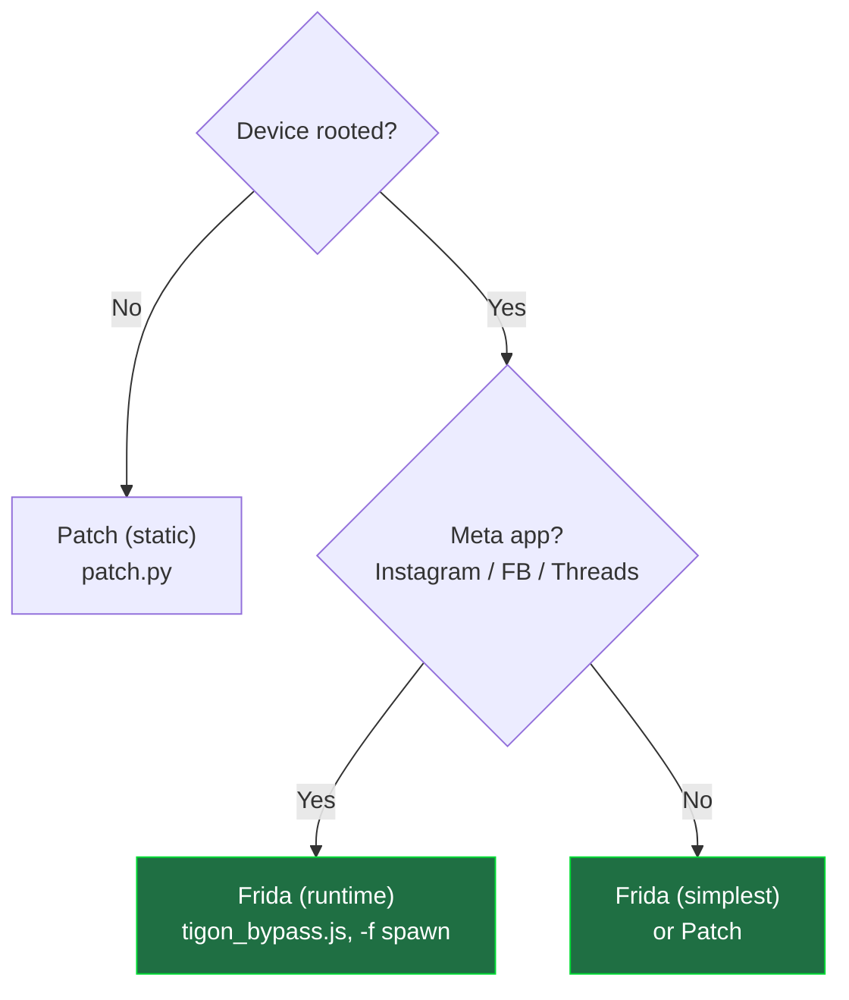

# Android SSL Pinning Bypass — Instagram / Meta (Frida) + universal APK patcher


Bypass **SSL pinning** on Android to inspect an app's HTTPS traffic during **authorized**
security testing. Covers **Instagram, Facebook, Messenger, Threads** (Meta's Tigon stack)
via **Frida**, plus a general-purpose **APK patcher** (Frida-gadget injection,
network-security-config, xapk/apkm merge) for ordinary and non-rooted targets.

Two complementary approaches:

1. **Frida (runtime)** — inject a hook script at app startup. No APK modification.
   Best for **rooted** devices and hardened apps (Instagram/Meta). → [GUIDE-frida.md](docs/GUIDE-frida.md)
2. **Patch (static)** — repackage the APK: merge splits, inject a Frida gadget or
   patch the network-security-config, then re-sign. Works on **non-rooted** devices
   and ordinary apps. → [GUIDE-patch.md](docs/GUIDE-patch.md)

📖 **Deep-dive:** [How Instagram's SSL pinning actually works, and how we bypassed it →](docs/INSTAGRAM-ANALYSIS.md)
(Tigon stack, the analysis, dead ends, and architecture diagrams).

> ⚠️ For authorized security research / pentesting only. Do not use against apps or
> accounts you do not own or have written permission to test.

---

## Which one should I use?



| | **Frida (runtime)** | **Patch (static)** |
|---|---|---|
| APK modified? | No (unmodified app) | Yes (repackaged + re-signed) |
| Device root needed? | **Yes** (frida-server) | No |
| Tamper/integrity detection | Avoided (app is original) | May trigger |
| Instagram / Meta (Tigon) apps | ✅ **Works** | ❌ gadget timing wall / NSC insufficient |
| Ordinary apps | ✅ Works | ✅ Works (gadget or NSC) |
| Effort | Low (one command) | Higher (merge/sign, minutes) |
| Entry point | [GUIDE-frida.md](docs/GUIDE-frida.md) | [GUIDE-patch.md](docs/GUIDE-patch.md) |

**Rule of thumb:** rooted device → use **Frida**. Non-rooted device, or you must ship a
self-contained APK → use **Patch**. For **Instagram/Facebook/Threads/Messenger**, use
**Frida** (their Tigon network stack defeats static approaches).

---

## What each piece does

### Frida scripts — which one?

Both are generic at heart (they hook `SSLContext` / `X509TrustManager` / Conscrypt), so
they are **not** Instagram-only. The difference is Tigon coverage:

| Script | Covers | Use for |
|---|---|---|
| **`frida/tigon_bypass.js`** | Meta **Tigon** stack **+** generic Conscrypt/SSLContext | Instagram/Facebook/Threads/Messenger **and** ordinary apps — safe default |
| `frida/generic-ssl-unpinning.js` | generic Conscrypt/SSLContext **+ older Meta `liger`** (no Tigon) | ordinary apps + pre-Tigon Meta builds; **won't** decrypt modern Instagram's main API traffic |

→ **Just use `tigon_bypass.js`** — it's a superset. For very broad coverage of unusual
stacks (Flutter, unusual OkHttp setups), a community "universal unpinning" script is a
good complement.

### `patch.py` — capabilities

- Accepts **`.apk` / `.xapk` / `.apks` / `.apkm`** (auto-detected)
- **Merges** split bundles into one universal APK (`--format apk`), or repackages as `.xapk`
- **Injects a Frida gadget** (+ optional script) so the app self-hooks on launch (no root)
- **Patches network-security-config** (`--patch-nsc`) to trust user CAs (MITM via proxy)
- **zipalign + sign + verify** (throwaway key by default, or bring your own)
- Warns when an app uses SoLoader/Superpack (where gadget injection won't help)

See [docs/GUIDE-patch.md](docs/GUIDE-patch.md) for full usage and limits.

---

## Repository layout

```
patchapk/
├── README.md
├── docs/                              # documentation
│   ├── GUIDE-frida.md                 #   Frida runtime method (Windows setup + test)
│   ├── GUIDE-patch.md                 #   static patch method (Windows setup + test)
│   └── INSTAGRAM-ANALYSIS.md                    #   analysis writeup + architecture diagrams
├── frida/                             # runtime hook scripts
│   ├── tigon_bypass.js               #   Meta/Tigon + generic bypass  ← use this
│   └── generic-ssl-unpinning.js  # generic + older Meta liger (no Tigon); Eltion
└── patcher/                           # static patch/repackage tool
    ├── patch.py                       #   CLI
    ├── config.py                      #   tunable settings
    ├── patch.bat                      #   Windows drag-and-drop launcher
    ├── requirements.txt               #   Python deps (lief, requests)
    ├── venv/                          #   (gitignored) create your own
    └── .tools/                        #   (gitignored) auto-downloaded APKEditor.jar
```

---

## Tested on

| | |
|---|---|
| Target app | **Instagram for Android v442.0.0.0.61** (analysis/decompile from the v440.x build) |
| Architecture | **x86_64** |
| OS | Android **12** (API 31), rooted emulator |
| Frida | frida-server **17.16.4** (x86_64) + frida-tools **17.16.4**, Python **3.13** |
| Patch toolchain | APKEditor **1.4.9**, SDK build-tools **r30.0.1**, JDK **17** |
| Result | `frida -f … -l frida/tigon_bypass.js` → pinning bypassed, traffic decrypted in Burp ✅ |

> `tigon_bypass.js` uses `initHybrid` overload auto-detection, so it is expected to work
> across Instagram versions (and other Tigon-based Meta apps) on both x86_64 and arm64 —
> only `frida-server` and the client must match your device's architecture.

---

## Requirements (Windows)

This is a summary. **Full step-by-step install (adb download, Python, JDK, PATH /
environment variables) is inside each guide's "Windows environment setup" section** —
[Frida setup](docs/GUIDE-frida.md#windows-environment-setup) /
[Patch setup](docs/GUIDE-patch.md#windows-environment-setup).

Versions in parentheses are what this project was verified with.

**Common**

| Requirement | Notes |
|---|---|
| Windows 10/11 | PowerShell + Git Bash both fine |
| Android SDK Platform-Tools (`adb`) | on PATH — <https://developer.android.com/tools/releases/platform-tools> |
| Android device / emulator | x86_64 emulator or an arm device |
| Proxy | **Burp Suite** / **mitmproxy** + its CA installed as a **user** cert on the device |

**Frida method** (see [GUIDE-frida.md](docs/GUIDE-frida.md))

| Requirement | Notes |
|---|---|
| Rooted device/emulator | required for frida-server |
| `frida-server` (17.16.4) | matching the device ABI, pushed to `/data/local/tmp` |
| Python **3.11+** (3.13) | Frida 17 dropped 3.10 |
| `frida`, `frida-tools` (17.16.4) | `py -3.13 -m pip install frida==<ver> frida-tools` — **version must match frida-server** |

**Patch method** (see [GUIDE-patch.md](docs/GUIDE-patch.md)) — no root needed

| Requirement | Notes |
|---|---|
| Python **3.10+** (venv) | `pip install -r requirements.txt` → `lief`, `requests` |
| Android SDK build-tools | `zipalign`, `apksigner` (auto-discovered) |
| JDK 17 | `keytool`, `java` (auto-discovered; set `JAVA_HOME` if needed) |
| APKEditor.jar | auto-downloaded to `.tools/` on first use (needs `java`) |

---

## Legal

SSL-pinning verification is a standard item in mobile app penetration testing
(OWASP MASVS). Everything here is for testing apps you are authorized to test.
The authors accept no responsibility for misuse.
