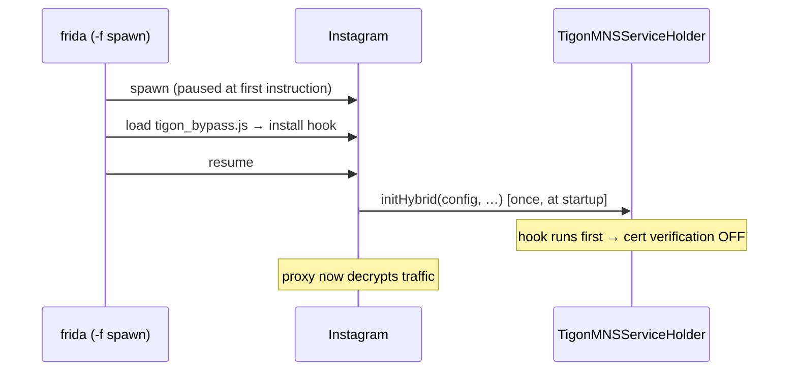

# Frida runtime guide (recommended for Instagram / Meta)

Bypass SSL pinning at **runtime** with Frida — the app APK is left completely
unmodified. This is the reliable method for hardened Meta apps
(Instagram, Facebook, Messenger, Threads) that use the **Tigon/MNS** network stack.

> Verified on Instagram **v442.0.0.0.61** (x86_64 emulator, Android 12; works across the
> v440–442 series). The bypass script auto-detects the `initHybrid` overload, so it is
> version-tolerant.

---

## How it works (30-second version)

Instagram's real certificate pinning is **not** OkHttp/`CertificatePinner` and there is
**no** `libinstagram.so`. Its main traffic runs through **Tigon** (Meta's cronet-based
stack), which turns cert verification on inside a Java config object passed to
`com.facebook.tigon.tigonmns.TigonMNSServiceHolder.initHybrid(...)`.

`tigon_bypass.js` hooks that call and, on the config, sets:

- `setEnableCertificateVerificationWithProofOfPossession(false)` — pinning off
- `setTrustSandboxCertificates(true)` — trust the proxy CA
- `setForceHttp2(true)` — use HTTP/2 instead of QUIC (so a normal proxy sees it)

plus a Conscrypt / `SSLContext` trust-all fallback.

`initHybrid` runs **once, early at startup**, so the hook must be installed *before* it —
which only Frida **spawn** mode (`-f`) guarantees. **Attach mode is too late.**



For the full architecture and the analysis behind this, see [INSTAGRAM-ANALYSIS.md](INSTAGRAM-ANALYSIS.md).

---

## Requirements

| Component | Notes |
|---|---|
| **Rooted** device / emulator | `adb root` works, or `su` is available. Required to run frida-server. |
| **frida-server** | Binary matching the device ABI (x86_64 emulator → `...-android-x86_64`). |
| **frida client** | **Same version** as frida-server. Frida 17.x needs **Python 3.11+**. |
| Proxy | Burp Suite / mitmproxy with its CA installed as a **user** cert on the device. |

> Emulator note: Android Studio's **"Play Store"** AVD images are **not rootable**
> (`adb root` fails). Use a **"Google APIs"** image (no Play Store, rootable) or a
> rooted third-party emulator (MEmu / LDPlayer / Nox — these usually have both root
> and Play Store).

---

## Windows environment setup

### 1. adb (platform-tools)

Download a minimal Windows adb from <https://github.com/awake558/adb-win> (*Code ▸
Download ZIP*), extract to e.g. `C:\adb`, and add that folder to **PATH**:

- Start menu → *"environment variables"* → **Edit the system environment variables** →
  **Environment Variables…** → under **User variables** edit **Path** → **New** →
  `C:\adb` → OK. **Open a new terminal.**
- CLI alternative: `setx PATH "$($env:Path);C:\adb"` (affects new terminals only).

```powershell
adb version        # verify
adb devices        # your device/emulator should appear
```

> Official package also works: <https://developer.android.com/tools/releases/platform-tools>

### 2. Python 3.11+ (Frida 17 dropped 3.10)

Install from <https://www.python.org/downloads/> with **"Add python.exe to PATH"** ticked.
`py -0p` lists versions. This guide uses `py -3.13`.

### 3. Frida client

```powershell
py -3.13 -m pip install "frida==17.16.4" "frida-tools"
frida --version        # 17.16.4
```

### 4. frida-server (on the rooted device)

Download the build matching your device ABI from
<https://github.com/frida/frida/releases>
(e.g. `frida-server-17.16.4-android-x86_64.xz`), unpack the `.xz`, then:

```powershell
adb push frida-server-17.16.4-android-x86_64 /data/local/tmp/frida-server
adb shell chmod 755 /data/local/tmp/frida-server
adb shell "/data/local/tmp/frida-server &"
frida-ps -U            # lists device processes if everything works
```

> **Client and server versions must match exactly**, and the server ABI must match the
> device (x86_64 emulator → `-x86_64`; most phones → `-arm64`).

### 5. Proxy + CA

Install **Burp Suite** / **mitmproxy**, install its CA on the device as a **user**
certificate (*Settings ▸ Security ▸ Encryption & credentials ▸ Install a certificate ▸
CA certificate*), and set the device Wi-Fi proxy to your PC's `IP:8080`.

---

## Usage

> Run these from the repository root (`patchapk/`) so `frida\tigon_bypass.js` resolves.

```powershell
# Start frida-server on the device (if not already running)
adb shell "/data/local/tmp/frida-server &"

# Spawn Instagram with the bypass script (spawn = -f is mandatory)
frida -U -f com.instagram.android -l frida\tigon_bypass.js
#   Look for: [+] Tigon initHybrid hooked   /   [+] SSLContext.init -> trust-all
```

Then set the device Wi-Fi proxy to your host `IP:8080` (Burp) and use the app.
`i.instagram.com` / `graph.instagram.com` requests appear decrypted in the proxy.

> If the `frida` command is not on PATH, use `py -3.13 -m frida_tools.repl` instead of `frida`.

### If `frida -f` times out — use the bundled runner (recommended)

On some apps/emulators (Instagram is common) `frida -f` fails with
*"Failed to spawn: unexpectedly timed out while waiting for app to launch"* even though
spawning actually works. **`frida\run.py`** does the spawn+attach+resume manually (which
does not hang) and bundles the Java bridge:

```powershell
py -3.13 frida\run.py                              # Instagram + tigon_bypass.js
py -3.13 frida\run.py <package> [script.js ...]    # custom target + one or MORE scripts
```

Pass extra scripts to load several at once (the equivalent of the CLI's repeated `-l`):

```powershell
py -3.13 frida\run.py com.instagram.android frida\tigon_bypass.js my-probe.js
```

It prints `[+] Tigon initHybrid hooked`, keeps the app hooked, and detaches on Ctrl-C.

---

## Testing / verifying the bypass

1. Launch with the command above; confirm the `[+] Tigon initHybrid hooked` line.
2. In the app, type any username + wrong password and press **Log in**.
3. **Success signal:** the app shows **"Incorrect password"** (a real server response —
   the request reached the server, so pinning is bypassed).
   **Failure signal:** **"An unexpected error occurred"** (network error — pinning still
   blocking; you probably used attach instead of `-f`).
4. Confirm the request is visible in Burp's HTTP history.

---

## Troubleshooting

| Symptom | Cause & fix |
|---|---|
| `frida -f` → *"timed out while waiting for app to launch"* | The CLI's spawn flow hangs even though spawning works (not anti-frida). First try `adb shell am force-stop com.instagram.android` + retry; if it keeps happening, **use `py -3.13 frida\run.py`** (spawn+attach+resume, does not hang). |
| App crashes on inject (tombstone shows `frida-agent` / stack overflow) | A script that hooks the same method repeatedly recurses. `tigon_bypass.js` hooks once; keep that guard in custom scripts. |
| Login shows *"An unexpected error occurred"* | Hook installed too late — use **`-f` (spawn)**, not `-U` (attach). |
| `ReferenceError: 'Java' is not defined` | Frida 17 raw scripts have no Java bridge. Run via the **`frida` CLI** (frida-tools loads it). |
| frida client import error (`NotRequired`) | Frida 17.x needs **Python 3.11+**; 3.10 fails. |
| Nothing in the proxy | Check Wi-Fi proxy + that the CA is a **user** cert. `setForceHttp2(true)` already forces HTTP/2 over QUIC. |
| `frida-ps -U` shows nothing | frida-server not running, or client/server version mismatch, or wrong ABI. |

---

## Notes

- Works on other Meta apps (Facebook / Threads / Messenger) that share Tigon —
  same script.
- The unmodified, store-installed app is ideal here: no repackaging means the app's
  tamper/signature checks never fire.
- Credit for the Tigon technique: frida codeshare `@takaotr` (and same-family scripts).
