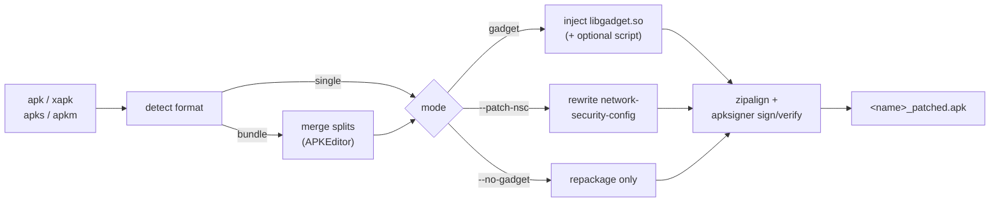

# Static patch guide (`patch.py`)

Repackage an Android app so it can be traffic-inspected on a **non-rooted** device —
no Frida server required. `patch.py` handles `.apk` / `.xapk` / `.apks` / `.apkm`,
merges split bundles, and can:

- **Inject a Frida gadget** (default) so the app self-loads a hook script, or
- **Patch the network-security-config** (`--patch-nsc`) to trust user CAs (MITM via proxy).

then zipaligns, signs and verifies the result.

> ⚠️ Static injection does **not** beat Instagram/Meta (Tigon) pinning — see
> [Limitations](#limitations). For those apps use [GUIDE-frida.md](GUIDE-frida.md).

---

## Windows environment setup

You do **not** need root or a device to *build* — only to install/test the result.
`patch.py` auto-discovers the external tools (PATH → Android SDK `build-tools/<ver>/` →
JDK `bin/`); `APKEditor.jar` is auto-downloaded to `.tools/` on first use.

### 1. Python 3.10+ and the venv

Install Python from <https://www.python.org/downloads/> with **"Add python.exe to PATH"**
ticked. All tool files live in `patcher/`; run from there:

```powershell
cd patcher
py -3.10 -m venv venv
venv\Scripts\python -m pip install -r requirements.txt   # lief, requests
```

### 2. JDK 17  (for `java` + `keytool`)

Install **Eclipse Temurin JDK 17** from
<https://adoptium.net/temurin/releases/?version=17> (Windows `.msi`). During install,
enable **"Set JAVA_HOME"** and **"Add to PATH"** if offered; otherwise set them manually
(see [Environment variables](#environment-variables-adb--jdk--build-tools)).

```powershell
java -version ; keytool -help    # verify
```

### 3. Android SDK build-tools  (for `zipalign` + `apksigner`)

Either install **Android Studio** and add *SDK Tools ▸ Android SDK Build-Tools*, or use
the standalone **command-line tools** (<https://developer.android.com/studio#command-tools>):

```powershell
cmdline-tools\bin\sdkmanager.bat "build-tools;34.0.0"
```

Tools land in `%LOCALAPPDATA%\Android\Sdk\build-tools\<ver>\` — `patch.py` finds them
there automatically. (Adding that folder to PATH is optional.)

### 4. adb  (only to install/test the result)

Minimal Windows adb: <https://github.com/awake558/adb-win> → extract to `C:\adb` → add to
PATH. (Official: <https://developer.android.com/tools/releases/platform-tools>.)

### Environment variables (adb / JDK / build-tools)

Add folders to **PATH** and set **JAVA_HOME**:

- **GUI:** Start menu → *"environment variables"* → **Edit the system environment
  variables** → **Environment Variables…** → edit **Path** (add the folder) / add a new
  **JAVA_HOME** variable → OK → **open a new terminal**.
- **CLI:**
  ```powershell
  setx PATH "$($env:Path);C:\adb"
  setx JAVA_HOME "C:\Program Files\Eclipse Adoptium\jdk-17.0.20.8-hotspot"
  ```
  (`setx` affects **new** terminals only; use the GUI for very long PATHs.)

---

## Usage

### Drag-and-drop (Windows, easiest)

Drop one or more `.apk` / `.xapk` / `.apks` / `.apkm` files onto **`patcher\patch.bat`**.
By default the batch runs `--patch-nsc --no-gadget` and produces a single installable
`<name>_patched.apk` next to each input. Multiple files at once are supported.

### Command line

```powershell
$py = "venv\Scripts\python"

# Inject the latest Frida gadget, auto-detect ABIs, sign with a throwaway key
& $py patch.py -i app.apk

# Give the gadget a script to run on load (auto SSL bypass on non-rooted device)
& $py patch.py -i app.apk --script bypass.js

# Bundles (xapk/apkm/apks) -> merge into ONE installable .apk
& $py patch.py -i app.apkm --format apk

# Network-security-config method (trust user CAs; best for hardened apps)
& $py patch.py -i app.apkm --patch-nsc --no-gadget

# Just repackage + sign, no injection, no external tools
& $py patch.py -i app.apk --no-gadget --no-sign
```

### Key options

| Option | Purpose |
|---|---|
| `-i, --input` | Input `.apk` / `.xapk` / `.apks` / `.apkm` |
| `-o, --output` | Output path (default `<name>_patched<ext>`) |
| `--format {auto,apk,xapk}` | `apk` merges a bundle into one universal APK (APKEditor); `xapk` repackages as `.xapk` |
| `--patch-nsc` | Trust user CAs via network-security-config (combine with `--no-gadget`) |
| `--script PATH` | JS script the injected gadget runs on load |
| `--gadget PATH` | Use a local Frida gadget instead of downloading |
| `--no-gadget` | Skip injection; just repackage + sign |
| `--no-sign` | Skip zipalign/sign/verify (no external tools needed) |
| `--keystore / --keyalias / --storepass` | Bring your own signing key |
| `--min-sdk-version N` | Pass an explicit minSdk to apksigner if it can't read the manifest |
| `--apkeditor PATH` | Use a local `APKEditor.jar` instead of auto-download |
| `-v, --verbose` | Verbose logging |

---

## How it works



- **Format detection** → for bundles, extracts and (with `--format apk`) merges all splits
  into one universal APK using [APKEditor](https://github.com/REAndroid/APKEditor).
- **Gadget injection** → finds an ELF `.so`, adds `libgadget.so` as a NEEDED dependency
  (via LIEF), ships the gadget + optional script, then rebuilds.
- **`--patch-nsc`** → decodes with APKEditor, overwrites the app's
  network-security-config to trust `system` + `user` CAs (and drops pin-sets), rebuilds.
- **Rebuild** preserves per-entry compression (so `resources.arsc`/manifest are never
  re-encoded), drops old v1 signatures, adds native libs uncompressed so `zipalign -p`
  can page-align them.
- **Sign** with `apksigner` (throwaway debug key by default), then verify.

Robustness: all heavy work happens in an ASCII temp workspace (so non-ASCII / Korean
paths don't break external tools or LIEF); every external command is a list-form
`subprocess` call (no `shell=True`); the final artifact is only published after every
step succeeds (a failed run leaves no output).

---

## Testing a build

```powershell
$adb = "adb"   # from Android SDK platform-tools

# Single .apk (merged or --format apk output)
& $adb install -r -d "<name>_patched.apk"

# Multi-apk bundle (.xapk/.apkm output) -> use a split installer such as SAI,
# or install all inner apks with:
& $adb install-multiple base.apk split_config.*.apk

& $adb shell monkey -p <package> -c android.intent.category.LAUNCHER 1
& $adb logcat | Select-String "<package>"
```

For a `--patch-nsc` build: install a proxy CA as a **user** cert on the device, set the
device proxy to your host, launch the app, and watch the proxy for decrypted traffic.

---

## Limitations

- **Instagram / Facebook / Messenger / Threads (SoLoader + Superpack + Tigon):**
  - Gadget-via-NEEDED injection **does not load** (they load native libs from a compressed
    `assets/lib/libs.spo` Superpack, not `lib/<abi>/`), and modifying those libs can make
    the app hang on launch. `patch.py` detects Superpack and warns.
  - `--patch-nsc` makes the app route through the proxy but Tigon pins in its own layer,
    so the main API traffic still won't decrypt on recent versions.
  - **Use the Frida runtime method for these apps** → [GUIDE-frida.md](GUIDE-frida.md).
- Merging a large app (e.g. a 250 MB Instagram bundle) takes a few minutes.
- A merged multi-DEX app may need the `jf` smali compiler for very large string pools —
  handled automatically by the NSC path; relevant only if you customize the pipeline.
