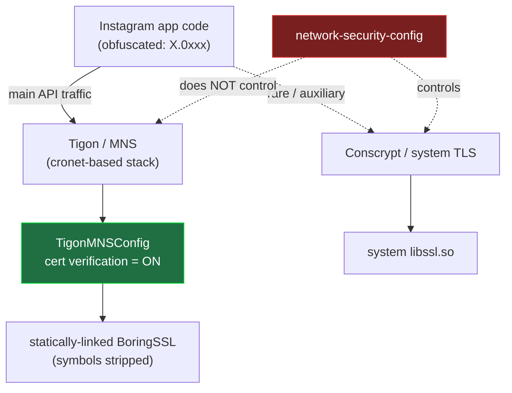
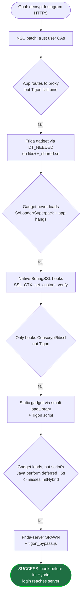
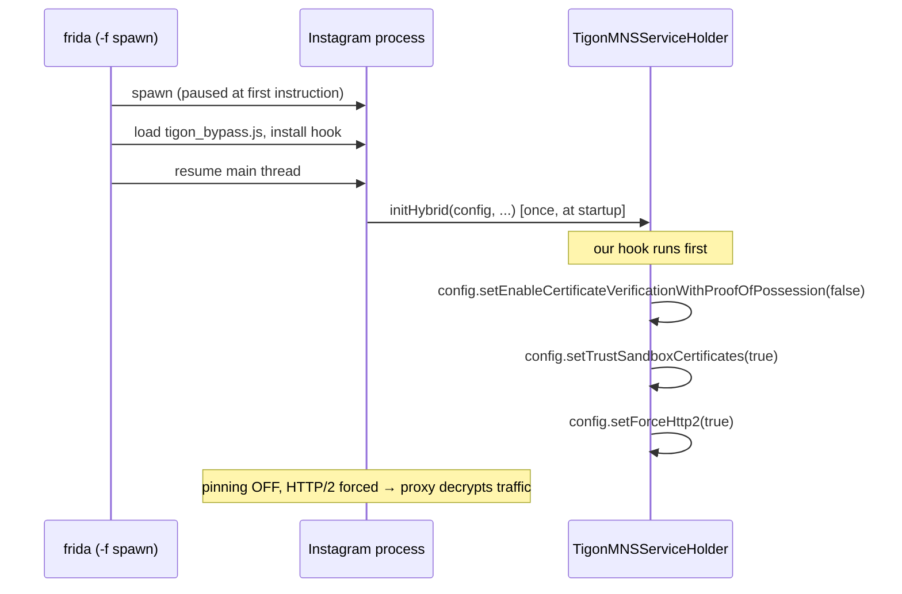

# Analysis: how Instagram's SSL pinning actually works, and how we bypassed it

A record of the investigation behind this toolkit — the methodology, the dead ends,
and the result.

> ### ⚠️ Scope — this is a point-in-time snapshot, not universal truth
>
> Everything below was analyzed against **one specific build**:
>
> | | |
> |---|---|
> | App (bypass verified) | **Instagram for Android v442.0.0.0.61** |
> | App (decompiled for details) | a **v440.x** build (class names / smali below) |
> | ABI | **x86_64** |
> | OS / device | Android **12** (API 31), rooted emulator |
> | Date | 2026-08 |
>
> Instagram ships new builds constantly and re-obfuscates aggressively. So treat this as
> **version-specific**:
> - The **overall shape is stable** across recent versions — Meta uses the **Tigon/MNS**
>   stack, and the Java hook point is `TigonMNSServiceHolder.initHybrid`. `tigon_bypass.js`
>   detects the `initHybrid` overload at runtime, so it tolerates version drift.
> - The **details are not** — obfuscated class names (`X.0xxx`), method overloads, dex
>   layout, native offsets, and even which layers exist **change between versions and
>   between architectures (x86_64 vs arm64)**. Do not assume any exact name/offset here
>   holds for the version you are testing; re-verify against your own build.
> - Findings for **iOS** or **other Meta apps** may differ again.

---

## TL;DR of findings

- Instagram's real pinning is **not** OkHttp `CertificatePinner`, and there is **no**
  `libinstagram.so`. Those (widely reposted in AI-generated blogs) **do not exist** in the
  real app.
- The real network stack is **Tigon / MNS** (Meta's cronet-based stack). Cert verification
  is turned on inside a **Java config** passed to `TigonMNSServiceHolder.initHybrid(...)`.
- The reliable bypass is a **Frida hook on `initHybrid`, installed at startup via spawn**.
- Static approaches (network-security-config, Frida-gadget injection) **fail** on Instagram
  because of SoLoader/Superpack packaging + the Tigon layer.

---

## Methodology / tools

| Step | Tool |
|---|---|
| Decompile APK to smali + resources | [APKEditor](https://github.com/REAndroid/APKEditor) (`d`), grep |
| Inspect native libs / ELF | Python `zipfile`, LIEF |
| Runtime introspection & hooking | Frida (`frida-server` + `frida-tools`) |
| Observe behavior / crashes | `adb logcat`, tombstones, `/proc/<pid>/maps`, screenshots |
| Confirm traffic path | `ss -tnp`, Wi-Fi proxy = Burp |

Everything was verified against the **real decompiled APK** — not assumed from blogs.

---

## Where the pinning actually lives

Key point: the **NSC** (which `--patch-nsc` edits) and the **system BoringSSL** (which
native hooks reach) do **not** govern Tigon's traffic. Only the **`TigonMNSConfig`** does —
and it's reachable from Java at `initHybrid`.

---

## What we tried, and what happened

| Attempt | Result | Why |
|---|---|---|
| `--patch-nsc` (trust user CAs) | ❌ | App reaches proxy, but Tigon pins in its own layer |
| Gadget via `DT_NEEDED` (LIEF) | ❌ | SoLoader loads libs from Superpack `libs.spo`, not `lib/<abi>/`; modifying libs → app hangs |
| Native BoringSSL hook | ❌ | Reaches only Conscrypt / system `libssl.so`, not Tigon's stripped BoringSSL |
| Static gadget + smali `loadLibrary` | ⚠️ | Gadget **loads** (proven), but the gadget script's `Java.perform` is deferred ~5 s → hook lands after `initHybrid` fired |
| **frida-server spawn + `tigon_bypass.js`** | ✅ | Script runs at first instruction → hooks `initHybrid` before it runs |

Two "walls" that turned out to be **false alarms**:

- *"`frida -f` times out → Instagram anti-frida"* — **No.** Spawn works; the timeout was
  transient (app already running / slow first-launch Superpack extraction). Retry succeeds.
- *"App crashes on inject → anti-frida detection"* — **No.** It was **our script** hooking
  `initHybrid` ~30× (async `Java.perform` defeated the guard) → stack overflow inside
  `frida-agent`. Fixed by hooking exactly once.

---

## The working bypass

**Proof it worked:** entering a wrong password produced the server's *"Incorrect password"*
response (the request reached Instagram's servers), and the requests appeared decrypted in
Burp. See [GUIDE-frida.md](GUIDE-frida.md) for the exact commands.

---

## Lessons

1. **Verify against the real binary.** Most online "Instagram SSL bypass" write-ups
   (libinstagram.so, `SecurityUtil.verifyCertificate`, fixed RVAs, OkHttp CertificatePinner)
   are AI-generated fiction — grepping the decompiled v440.x build returns **0** matches.
2. **Meta apps = Tigon.** The bypass surface is the Java config at `initHybrid`.
3. **Timing is everything.** The hook must precede `initHybrid`; only spawn guarantees it.
4. **Blame your own script first.** The "anti-frida crash" was a re-hook bug, not the app.
